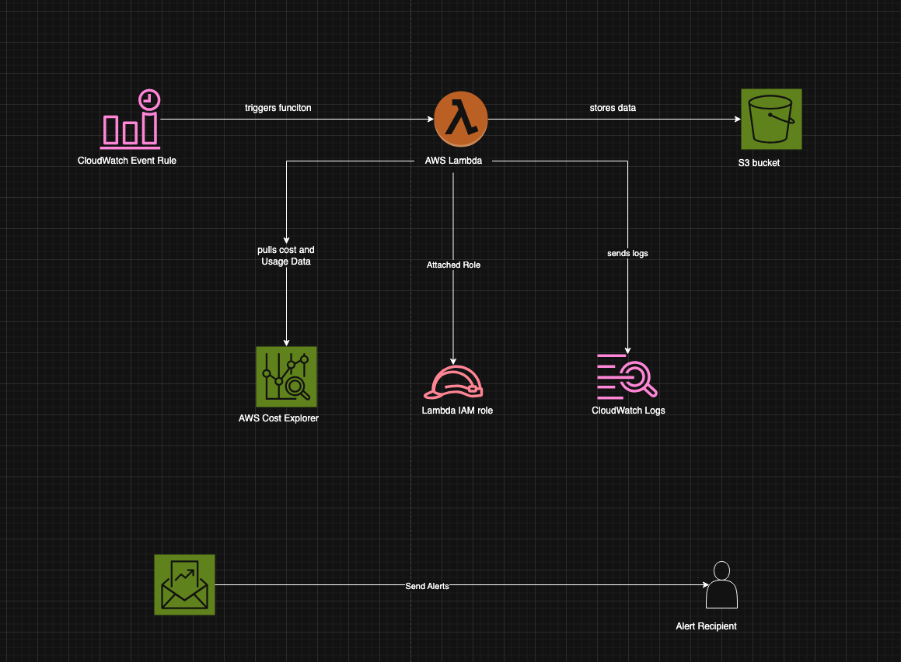

# AWS Cost and Usage Report Automation
This Terraform code provisions an automated AWS Lambda-based solution to generate periodic AWS Cost and Usage reports using the Cost Explorer API.
The reports are stored in an S3 bucket, and the Lambda is scheduled to run based on your selected frequency (daily, weekly, or monthly).

├── README.md
├── documentation
│   └── cur-s3-diagram.png
    └── architecture-overview.docx

├── lambda
│   ├── cur-data-to-s3.py
│   └── cur-data-to-s3.zip
└── terraform
    ├── README.md
    ├── budget.tf
    ├── cloudwatch.tf
    ├── data.tf
    ├── iam.tf
    ├── lambda.tf
    ├── main.tf
    ├── s3.tf
    └── variables.tf


Detailed Architecture overview - aws-cost-report/documentation/architecture-overview.docx

## Manual Deployment Steps

> **Prerequisite**: Ensure you have `awscli` and `terraform` version **>= 1.8.0** installed.

### 1. Authenticate with AWS
Log in to the target AWS account using the AWS CLI.

### 2. Set Your AWS CLI Profile
export the AWS_PROFILE on the cli. (Make sure your AWS PROFILE is set, either by running below command or by updating profile = <PROFILE_NAME> in main.tf )

## Configuration

Customize the following variables in `variables.tf` or via CLI input:

- `CUR_RANGE`: `daily` (default), `weekly`, or `monthly`
- `REGION_NAME`: AWS region for deployment (default: `eu-west-1`)
- `alerts_recipients`: List of emails to receive alerts


## Manual Deployment Steps

> **Prerequisite**: Ensure you have `awscli` and `terraform` version **>= 1.9.0** installed.

### 1. Authenticate with AWS
Log in to the target AWS account using the AWS CLI.

### 2. Set Your AWS CLI Profile
Set the appropriate AWS CLI profile (if using named profiles):

```bash
export AWS_PROFILE=default
```

Alternatively, ensure `main.tf` includes the correct profile:
```hcl
provider "aws" {
  profile = "<PROFILE_NAME>"
  region  = "eu-west-1"
}
```

### 3. Navigate to Terraform Directory
```bash
cd terraform
```

### 4. Initialize Terraform
```bash
terraform init
```

### 5. Preview the Plan
```bash
terraform plan
```

### 6. Apply the Infrastructure
```bash
terraform apply
```

### 7. Destroy the Stack (Teardown)
> ⚠️ **Important**: Before destroying, manually empty the contents of the S3 bucket.

```bash
terraform destroy
```

